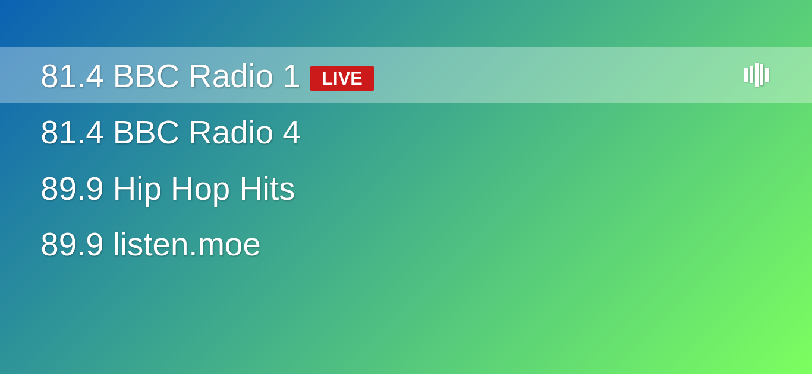

# Live Streaming Audio

## Description

This example displays how to use howler.js to stream live audio, such as in this simple radio app.

* Controls: start, stop.
* Allows switching between multiple live streams.
* Full-screen and responsive for desktop/mobile.

## Credits

powered by [howler.js](https://github.com/goldfire/howler.js)
